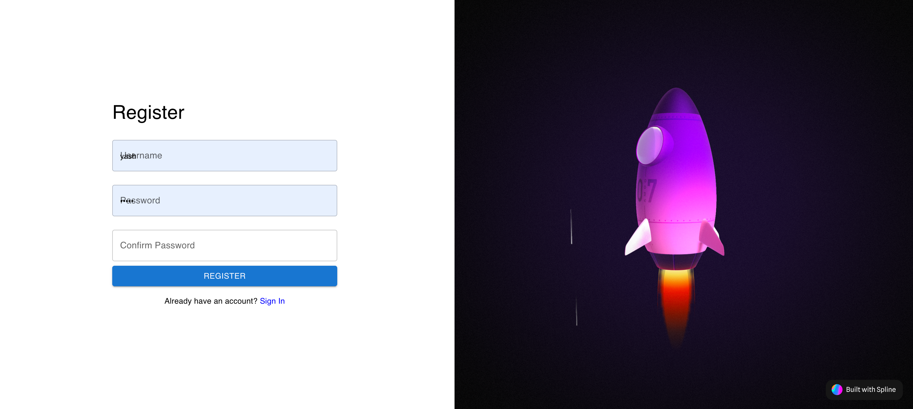
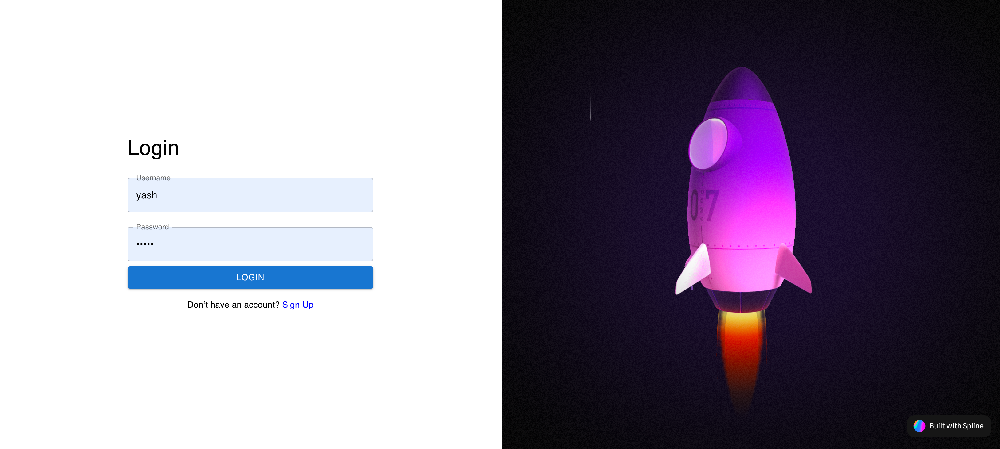
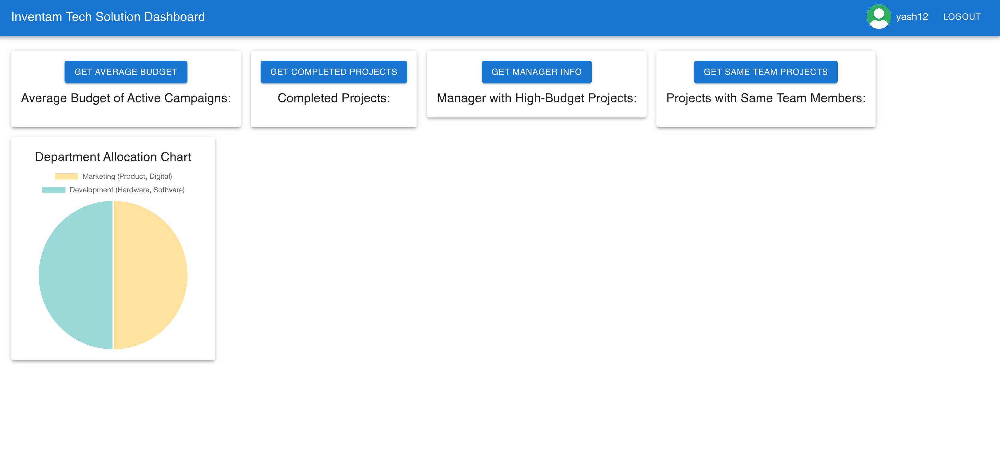

# MERN Stack Project: Session-Based Authentication and Dashboard

## Project Overview

This project is a MERN stack (MongoDB, Express, React, Node.js) web application featuring session-based login authentication. The application also includes a protected dashboard route that fetches and displays data using various APIs.

---

## Features

### 1. **User Authentication**

- **Login**: A session-based login system that handles authentication on both the front-end and back-end using tokens.
- **Logout**: The application supports logout, which clears the session and invalidates user access to protected routes.

### 2. **Protected Dashboard**

The application features a dashboard that is accessible only to authenticated users. Unauthorized users will be redirected to the login page.

### 3. **API Endpoints**

The back-end provides several APIs that interact with a JSON data structure that includes details about departments, projects, and campaigns.

## ##Register screen

##Login screen

##DashBoard screen

